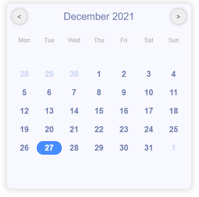

# Custom_calendar_vs

<div align="center">
  
</div>

Custom react calendar with date and range selection

Built with React 17.0.X and Rollup 2.X

Dependencies moment.js

## Before you continue

Custom-calendar-vs is under constant development.

### Installation

Add the Calendar to your project by executing `npm install custom-calendar-vs` .

### Usage

Example of basic code:

```js
import React, { useState } from "react";
import moment from "moment";
import { Calendar } from "../components/Calendar/Calendar";

export const App = () => {
  const [selectedDate, setSelectedDate] = useState(moment());
  return (
    <Calendar
      setSelectedDate={(e) => setSelectedDate(e)}
      format="range"
      size="sm"
      dayFormat="normal"
    />
  );
};
```

Check the [repo](https://https://github.com/vibin-230/custom_calendar_vs) for the code base.

#### Props

| Prop name      | Description                                                        | Default value                           | Usage                                                                                                                                                                                         |
| -------------- | ------------------------------------------------------------------ | --------------------------------------- | --------------------------------------------------------------------------------------------------------------------------------------------------------------------------------------------- |
| format         | Chooses type of date selection: single/range                       | "single"                                | `format = "single"/ format = "range"`                                                                                                                                                         |
| setSelecedDate | Call back returning the choosen dates(in moment) as per the format | `(Moment())=>setSelectedDate(Moment())` | <ul><li> format = "single" =>> `(date)=>setSelectedDate(date) -> return moment()` </li><li>format = "range" =>> `(date)=>setSelectedDate(date) -> returns [moment(),moment(),....]`</li></ul> |
| size           | Size of the calendar                                               | "md"                                    | `size = "sm" / size = "md" / size = "lg" `                                                                                                                                                    |
| dayFormat      | Displays the day name in single/three letter format                | "normal"                                | `dayFormat = "normal" / format = "short" `                                                                                                                                                    |
